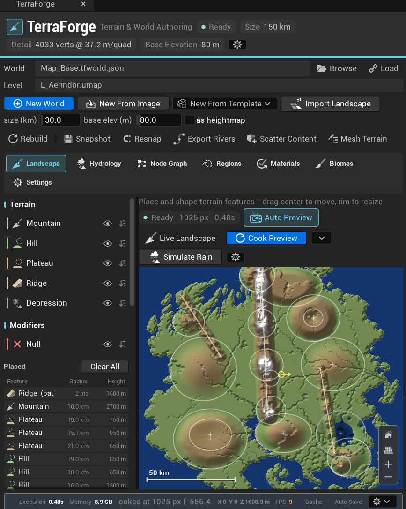

# Blake Swing

**Gameplay Programmer | C++ · C# · Lua | Unreal Engine · Unity**

I build gameplay systems, playable prototypes, and tools for creating game worlds. My work spans combat and interaction mechanics, terrain authoring inside Unreal Engine, and gameplay programming and reverse engineering for SWGEmu.

I'm seeking **Gameplay Programmer** and **Gameplay Programmer Intern** opportunities.

[GitHub](https://github.com/Sphinksz) · [itch.io](https://phoenixdevelopment.itch.io/) · [Resume (PDF)](assets/Blake_Swing_Gameplay_Programmer_Resume.pdf) · [Email](mailto:blake.a.swing@gmail.com)

## Selected work

| Project | My role | Focus | Explore |
| --- | --- | --- | --- |
| **Brushfire** | Sole programmer | Combat and painting systems; IndieCade Climate Jam 2025 | [Game page and demo](https://zygarde824.itch.io/brushfire) |
| **Veltino Grove** | Sole programmer | NPC interaction, cooking, ingredient collection, and karma | [Game page and build](https://hlim951.itch.io/veltino-grove) |
| **Terra Forge** | Independent developer | Terrain and world authoring inside Unreal Engine 5 | [Features and preview](#terra-forge) |
| **SWGEmu** | Gameplay programmer / reverse engineering contributor | Shared spatial partitioning architecture for ground and space zones | [Technical overview](#swgemu) |

## Brushfire

**Unreal Engine · Game jam team project · 2025**

Brushfire is an action-adventure game about protecting and restoring a forest. Players switch between fighting fire-based enemies and using a painting mechanic to repair the environment.

**My contribution**

- Served as the sole programmer within a 12-person development team.
- Implemented the combat and painting systems for the playable demo.
- Brought the team's gameplay concepts into an interactive Unreal Engine experience.

**Team result:** Placed **6th overall out of 33 entries** in IndieCade Climate Jam 2025.

[Game page and demo](https://zygarde824.itch.io/brushfire) · [Jam results](https://itch.io/jam/climate-jam-2025/rate/3673860)

## Veltino Grove

**Unreal Engine · Game jam team project · 2024**

Veltino Grove is a 3D cooking adventure about reviving a dying forest. Players explore, gather ingredients, interact with characters, and run a restaurant while balancing a karma system.

**My contribution**

- Served as the sole programmer on the game jam team.
- Built the NPC interaction, ingredient collection, cooking, and karma systems.
- Connected these mechanics into a playable exploration and cooking experience.

[Game page, build, and design documents](https://hlim951.itch.io/veltino-grove)

## Terra Forge

**Unreal Engine 5 · Independent development · 2026**

Terra Forge is a terrain and world-authoring plugin that brings terrain creation into Unreal Engine. It lets me preview and adjust terrain features in real time before committing them to the level. The goal is to reduce the need to move between the engine and external world-building tools.

**Working features**

- Terrain feature creation and editing with a live preview.
- Water and region authoring within the same tool.
- Texture changes driven by height or regions.
- Terrain authoring tested at world sizes up to **150 km**.

This is an independent project developed with AI-assisted coding.

*Development screenshot showing terrain features, region and material tools, and the world preview.*

## SWGEmu

**C++ · Lua · Gameplay systems · Reverse engineering**

I contributed to SWGEmu as a gameplay programmer and on the reverse engineering side. A major contribution was implementing its initial octree to support Jump to Lightspeed space zones.

**The technical problem**

The game's existing spatial systems were built around quadtree zones. Supporting space required a three-dimensional spatial structure while preserving the existing ground-zone behavior.

**My contribution**

- Refactored the quadtree-dependent architecture around a shared `Tree` base type.
- Retained quadtree partitioning for ground zones and implemented octree partitioning for space zones.
- Updated the systems affected by that change throughout the codebase and checked their behavior after the refactor.
- Contributed gameplay, networking, and scripting fixes in C++ and Lua.

**Outcome:** Established a shared spatial architecture that could support both ground and space zones. This work required tracing dependencies across the game and checking that existing systems continued to function.

[My SWGEmu Core3 fork](https://github.com/Sphinksz/Core3)

## Additional projects

These smaller projects include solo coursework, experiments, and development tools. Links labeled **project notes** lead to repository documentation.

| Project | Focus | Link |
| --- | --- | --- |
| **Class2024InkleProject** | Solo interactive-fiction prototype exploring functions in a standalone Inkle project | [Play in browser](https://phoenixdevelopment.itch.io/inkieadventure) |
| **Run and Gun** | Unreal Engine coursework project | [Project notes](https://github.com/Sphinksz/Swing-G300-Week7) |
| **3D Platformer** | Unreal Engine 5.4.4 coursework project with directional coin interactions | [Project notes](https://github.com/Sphinksz/Swing-G300-Week6) |
| **Algebra Manager** | C# SWGEmu mod manager; work in progress | [Source code](https://github.com/Sphinksz/algebra-manager) |

## Technical skills

- **Languages:** C++, C#, Lua, Python, C, Java, JavaScript.
- **Engines and tools:** Unreal Engine 5, Unity, Git, GitHub, Visual Studio, JetBrains Rider, Inkle.
- **Areas of work:** Gameplay mechanics, AI behaviors, user interfaces, multiplayer networking, spatial partitioning, scripting, debugging, and reverse engineering.

## Background and contact

I studied Computer Science and Game Development at **Indiana University Bloomington from 2023 to 2025**. I also served as a **U.S. Army Explosive Ordnance Disposal (EOD) team leader**, leading a two-person team where technical care, coordination, and clear communication were essential.

For gameplay programming opportunities, contact **[blake.a.swing@gmail.com](mailto:blake.a.swing@gmail.com)**.
